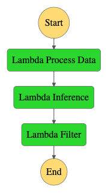
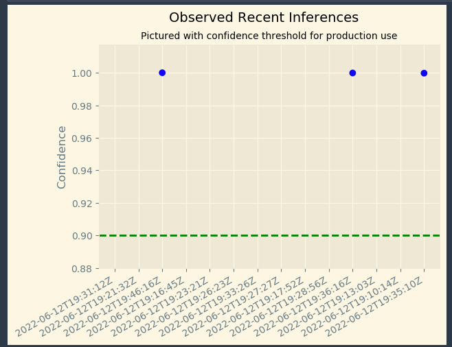

# Scones Unlimited - Image Classification
Repository for projects related to the MLEng nanodegree program from Udacity

## Instructions
In order to replicate the project, make sure to install the required packages included in the 
.py files.

    $python3 main.py #Download data, preprocess, train and deploy
    $python3 simulation.py --t <time> #Execute simulation for <time> minutes

## Description
This repository contains the files used on the development of the image classifier used by scones unlimited.
The development consists on those steps : 
1. Download data
2. Preprocess data
3. Training
4. Deployment
5. Workflow
6. Simulation

### Preprocess.py
The preprocess.py contains the functions used for download, preprocess data and send it to s3 
repository.

The data collected for training the model is hosted by the university
of Toronto in the web site : https://www.cs.toronto.edu/~kriz/cifar-100-python.tar.gz.

### Training.py
The training.py file executes a training job based on the data
we have sent to s3 during the preprocess phase. We use an algorithm
implemented by aws called <strong>image_classifier</strong>. We also send the
trained model to s3 in a .tar.gz file.

### Endpoint.py
The endpoint.py file executes the deploy of the trained model through an aws
endpoint. This endpoint will be called by our lambda functions during the workflow.

### Main.py
This file imports the other modules and executes the required actions in other to make
the deployment of the model (preprocess + training + deploy)

### Simulation.py 
This file simulates the execution of our workflow by sending images to be classified by our model
and activating the state machine.

## Workflow
The workflow consisted in our machine learning system is based on three lambda functions connect
with each other by a step function. Those lambda functions are responsible for :
1. Serialize data from s3 according to the received file name (key)
2. Perform inference
3. Filter inferences above defined threshold. 

The input, to be provided by our client system (after sending the file to the correct s3 bucket) 
should be a json such as :

    {
      "image_data": "",
      "s3_bucket": MY_BUCKET_NAME,
      "s3_key": "test/bicycle_s_000513.png"
    }

This is how the simulation looks like when receiving post solicitations to be classified and used 
in the workflow :

The lambdas script are inserted into the lambda.py file. The definition
used in the step-function is :

    {
      "Comment": "A description of my state machine",
      "StartAt": "Lambda Process Data",
      "States": {
        "Lambda Process Data": {
          "Type": "Task",
          "Resource": "arn:aws:states:::lambda:invoke",
          "OutputPath": "$.Payload",
          "Parameters": {
            "FunctionName": "arn:aws:lambda:us-east-1:820235860091:function:serializerImageData:$LATEST",
            "Payload.$": "$"
          },
          "Retry": [
            {
              "ErrorEquals": [
                "Lambda.ServiceException",
                "Lambda.AWSLambdaException",
                "Lambda.SdkClientException"
              ],
              "IntervalSeconds": 2,
              "MaxAttempts": 6,
              "BackoffRate": 2
            }
          ],
          "Next": "Lambda Inference"
        },
        "Lambda Inference": {
          "Type": "Task",
          "Resource": "arn:aws:states:::lambda:invoke",
          "OutputPath": "$.Payload",
          "Parameters": {
            "Payload.$": "$",
            "FunctionName": "arn:aws:lambda:us-east-1:820235860091:function:imageClassificationInference:$LATEST"
          },
          "Retry": [
            {
              "ErrorEquals": [
                "Lambda.ServiceException",
                "Lambda.AWSLambdaException",
                "Lambda.SdkClientException"
              ],
              "IntervalSeconds": 2,
              "MaxAttempts": 6,
              "BackoffRate": 2
            }
          ],
          "Next": "Lambda Filter"
        },
        "Lambda Filter": {
          "Type": "Task",
          "Resource": "arn:aws:states:::lambda:invoke",
          "OutputPath": "$.Payload",
          "Parameters": {
            "Payload.$": "$",
            "FunctionName": "arn:aws:lambda:us-east-1:820235860091:function:filterLowConfidencePredictions:$LATEST"
          },
          "End": true
        }
      }
    }

### Monitoring
Our endpoint was configured to send all data processed to s3 bucket for further
monitoring. By working that data, we can construct visualizations of how our model has performed :
